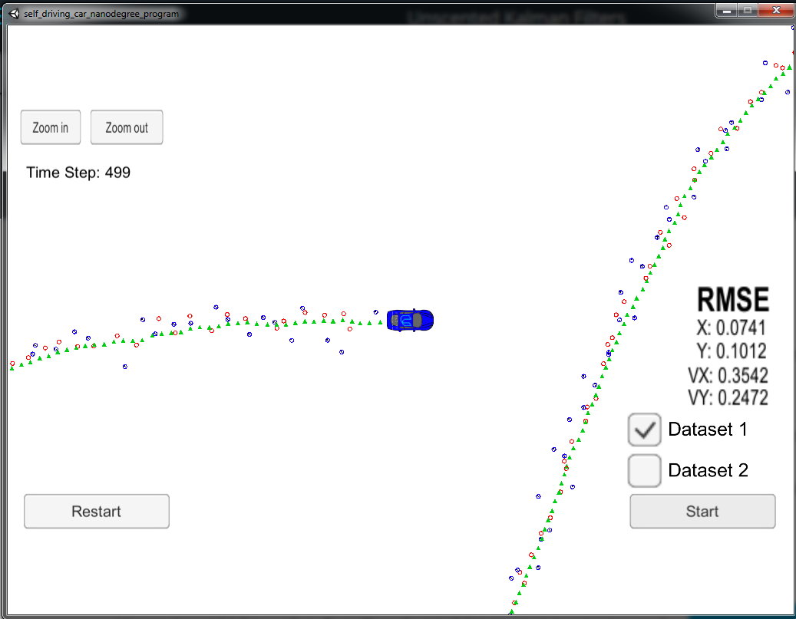

# Unscented Kalman Filter Project

In this project I utilize an Unscented Kalman Filter to estimate the state of a moving object of interest with noisy lidar and radar measurements.

This project involves the Term 2 Simulator which can be downloaded [here](https://github.com/udacity/self-driving-car-sim/releases)
